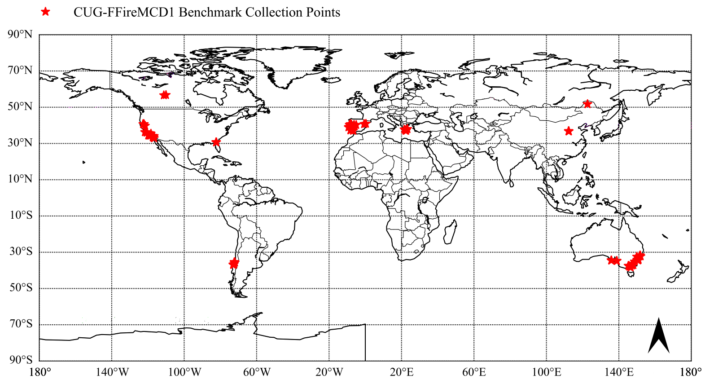

# CUG-FFireMCD1

### Dataset：CUG-Forest-Fire-MODIS-ChangeDetection-V1.0 

The changes that can be observed through the MODIS time series usually have a large degree of disturbance and good usability, and a relatively basic test can be performed for the models proposed by scholars. MOD13A2 products have advantages in terms of the stability and location of change points. They largely exclude cloud and noise interference, and EVI changes are more evident, making them more relevant for large-scale forest fires. We hope that, through CUG-FFireMCD1, scholars will be able to determine a change detection model suitable for large-scale forest fires and effectively verify the effectiveness of the research model. 

We collected natural disasters caused by fires since 2000 from the [NCDC](http://disaster.casnw.net/\#/root/view) and recorded the following three parameters: 
- The city districts and counties in which the fire occurred.
- The coordinates of the fire.
- The time of the fire. 

To determine the location of the fire, we used [MODIS FireCCIE51 data](https://climate.esa.int/en/projects/fire/), which represent a map of the global burning area produced by the European Space Agency(ESA) Fire Interference Climate Change Initiative (CCI) project from satellite observations. These MODIS FireCCI51 pixel products are distributed in the form of six continental tiles and are based on MODIS data with a resolution of 250 m collected on the TERRA satellite during 2001--2019. GEE was used to extract the EVI time series in MOD13A2. To ensure that there was enough time in the time series to detect forest fires and recovery, we set the extraction time to six years and placed the fire location in the second to fourth years. In addition, to ensure the diversity of the time series, we only extracted five EVI time series at most for a specific fire event for the dataset collection location.

CUG-FFireMCD1 has 132 time series data, each of which corresponds to a real fire event, is randomly selected in the fire area, and has at least one stable change point.  However, we still faced some problems. We could determine the exact date of the disturbance in the forest based on the event, but the disturbance points of other unknown events still needed to be marked. There might have been multiple hidden change points in a time series. Other label points were determined using four detection models(BFAST, Prophet, CCDC, LandTrendR), and this stage ensured the best accuracy of the label. Therefore, we set the labels of the dataset to two types: a reliable label and a label predicted by the models, which was for reference.

